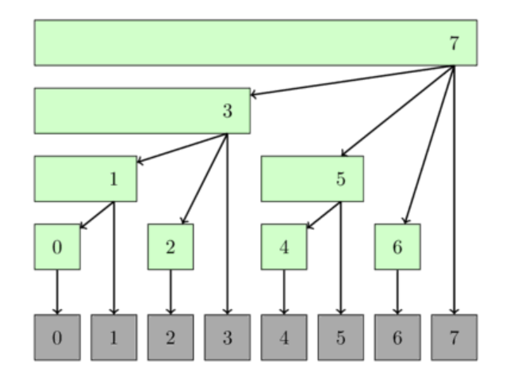

# Binary indexed tree

Aka Fenwick tree

## Definition

Given a [group operation](../Operation_category.md) $f$ and an array A of length N

A binary indexed tree is a data structure which:

* Calculate f on the given range $ f(A_l, A_{l+1}, A_{l+2}, \ldots ,A_r)$  in O(log(n)) time

* Update an element in A in O(log(n)) time

* Required O(N) memory

Basically, it is an array of length N $ T[0 \ldots N-1] $ where each element $ T_i = f(A_{g(i)}, \ldots, A_i) $ , $ g $ is some function such that $ 0 <= g[i] <= i  $ . The data structure is called tree because there is a presentation of it in form of tree. With this structure:

* The calculation $f(0, x)$ can be taking as $f(T(x), T(g(x) - 1), T(g(g(x) - 1)) \ldots, T(0) )$ 

* The updation at $i$ will need to update every $ T_j $ where $ g(j) <= i <= j $

## General logic for choosing $g(i)$ function

For $ g $ function, we can choose:

* $ g(i) = i $ , which make T become A , causing the calculation slow O(n), and the updation fast O(1)

* $ g(i) = 0 $, which make T become an aggregated result table, causing the calculation fast O(1) and updation slow O(n)

=> Better choose a function that can balance between updation / calculation

## 0-based index implementation

For the 0-index implementation, g(i) is defined by flip all trailing 1 bits with 0 bits. For example:

* $ g(11) = g(1011_2) = 1000_2 = 8 $

* $ g(12) = g(1100_2) = 1100 = 12 $

* $ g(15) = g(1111_2) = 0000_2 = 0$

The given function can also be written as $ g(i) = i \& (i +1)  $.

The updating index can be calculated as function $h(i)$ , which will flip the last unset bit. If $A_i$ is updated,  all $T$ updating  indexes would be $ i, h(i),h(h(i)), \ldots, N $. This function can be written as $ h(i) = i | (i+1)$

* $ h(10) = h(1010_2) = 1011_2 = 11 $

* $ h(11) = h(1011_2) = 1111_2 = 15  $

Tree presentation:

     

## 1-based index implementation

For the 1-based index implementation , $ g(x) $ can be defined as flip the last set bit which can be written as: $ g(x) = x - (x \& (-x)) $  as $ x \& (-x)$ is the last set bit value

* $g(8) = g(1000_2) = 0000_2 = 0$

* $ g(7) = g(111_2) = 110_2 = 6 $ 

* $g(6) = g(110_2) = 100_2 = 4$

* $g(4) = g(100_2) = 000_2 = 0$

h(x) would be defined as $ h(x) = x + x \& (-x)$.

## For non-group operation

For non-group operation like min on range $ [0, r] $, we can still do it, but the updation would be limited as updated value must be smaller than original value, also, it would be hard to do on any arbitrary  range $ [l, r]$.
