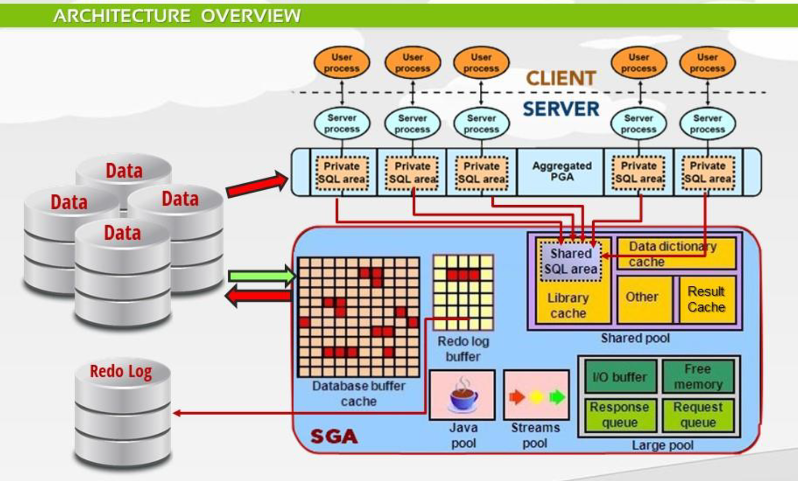
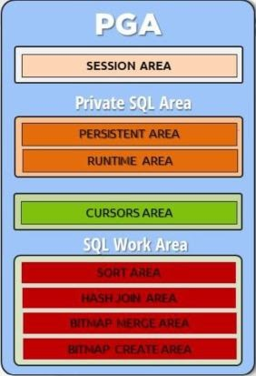
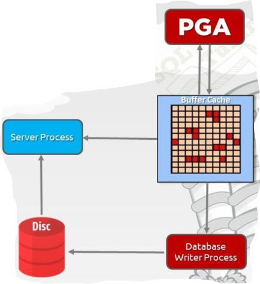
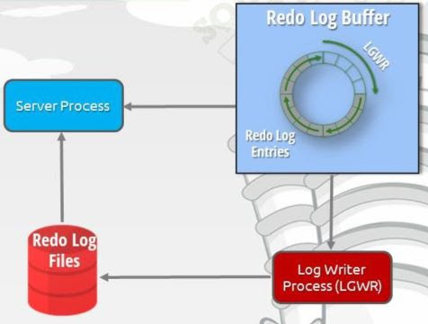

# PGA (Private Global Area)

Each user can only access their PGA. Each PGA would contain:
1. Session area:   
   When ever a user connect to DB, a session is created. 
   This area will store session variables, login information, session status, etc.
3. Private SQL Area:  
   Persistent area stores bind variables of cursors and releases them  once the cursors is closed.  
   Runtime area stores execution state information such as did we start/finish reading a table, etc.
5. Cursors area: Store cursor's information
6. SQL work area: Space for operating data from the disc like sort, join, merge, group, etc 
   => Insufficient space in PGA could lead to performance issues.
# SGA(Shared Global Area)
## Shared pool
1. Data dictionary cache  
   Contains cache information about the database objects definition and permission.  
   For example, when user query: `select * from Employee`, the database could look up to this cache instead of
   reading from the disc to find out which columns to query, whether Employee is a valid table, whether the user has permission to access the table, etc.
2. Result cache  
   Cache the queries/functions's result. If user(s) run the same query/function repetitively, the database would return the result from the cache.   
   If the database has a changes, the result cached will get flushed.  
   If the result cache is out of memory, it would delete the less common use result.
3. Library cache  
   Shared SQL area contains the execution plans since creating them is a costly process.
   The library cache also contains procedures, packages, locks, etc.
## Database buffer cache

This is the largest memory area in SGA. Oracle will copy data block from disc to buffer cache to speed up the query 
since reading from memory is way faster than from disc. Once a query need data of some table, it will first check on the buffer cache and only query the missing one.  
It is maintained by a complex algorithm, which would save the most frequently used,
and most recent data blocks because the memory is finite.  
Once user update, the data will be copied to the buffer cache, modified, and when user commit, 
Database Writer Process will write to the disc. 
This technique will also speed up the modification since the whole block is written. 
Oracle also use this for concurrency handling.
##  Redo log buffer

Once user change the database by inserting, updating, deleting, creating, alter, drop operation, 
a redo log entry is created and saved. They will be used for recovery operation 
(It is __NOT ROLLBACK__. When the user rollback, the redo log will also be deleted.).  
Redo log entries will be first saved in the redo log buffer. When the buffer is (1/3) full or when user commit, 
they will be written to the redo log files. Also, the Log Writer Process run every 3 seconds to write redo log to the disc.
If the user rollback, the redo log will also be deleted.  
Redo log buffer is a circular buffer, when the buffer full, it will be written from the start.

## Java pool - Stream pool
Java pool contains Java classes used by the database.  
Stream pool responsible for streaming the data.
