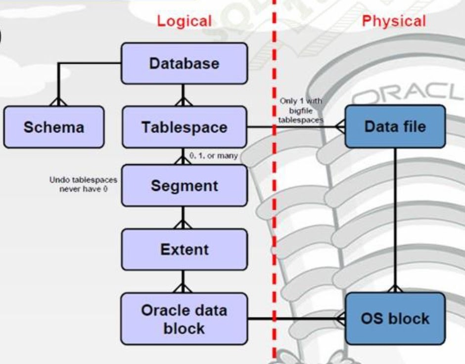
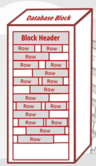

# Data structure

## Logical database structure

### Block

Block is a logical block, consist of several operating system blocks. Their size is preconfigured from 2-32KB (default 8KB).  
Block header contains block type (block saving rows or indexes), row directory (physical addresses of each row - ROWIDs), 
table information (the table(s) the block saving the data for).  
Data in a block is saved with space between them. You could use PCTFREE/PCTUSE to specify the space size. 
The more space means higher performance when editing a row but more spatial cost and vice versa.

### Extent

### Segment

There are 4 types of segments: Data, Index, Undo (Rollback) and Temporary. 

- Temporary segments provide temporary work area.
- Undo and Rollback segments are quite the same. If Oracle creates and manages them via Auto Undo Management (AUM), they are call Undo segments, or else Rollback segments

### Tablespace

Used to group all related data in one container. There are 2 types of tablespace:

1. Temporary tablespace contains temporary data that only need to be stored in a session, stored in temporary files
2. Permanent tablespace stores persistent schema objects, stored in data files.

Each database must have at least 2 tablespaces: SYSTEM and SYSAUX.

We can also handle undo by creating undo tablespaces instead of using undo/rollback segments.

### User vs Schema

* In oracle, a schema is a collection of database objects own by a user. __A user owns a schema and have the same name__.
* The `CREATE USER` command creates user and a schema for that user. As well as `DROP USER` will delete both user and schema.
* the `CREATE SCHEMA` command __does not create a `schema`__ as it implies.

## Physical database structure

Oracle stores data physcically in datafiles that associated with the corresponding tablespaces. A tablespace can consist of 1 or multiple datafiles.