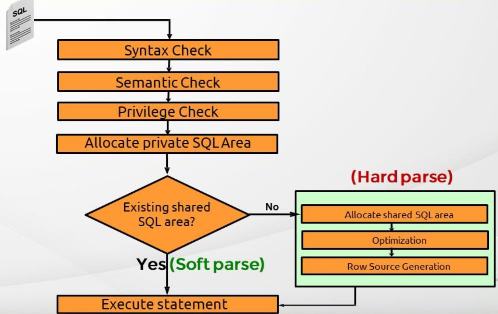
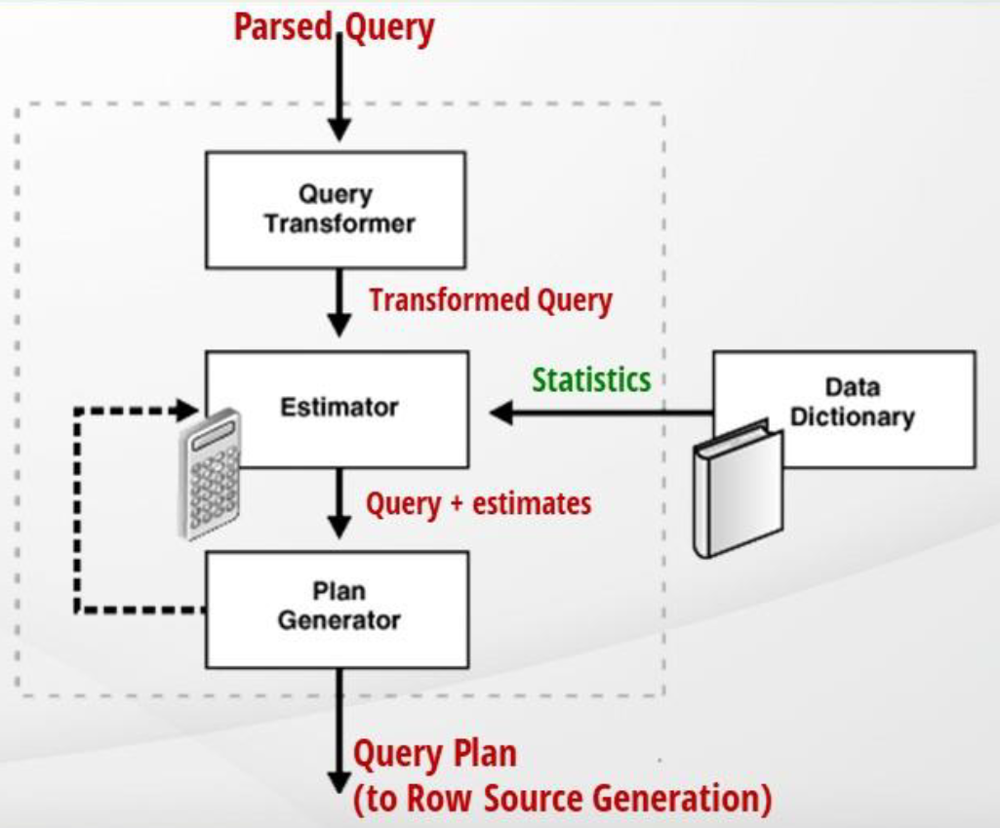
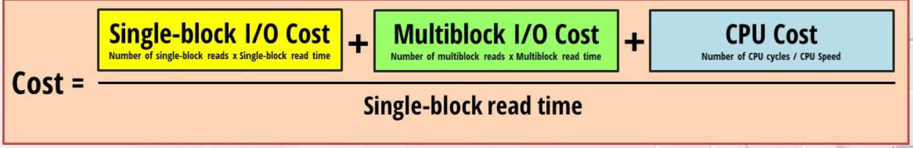

# HOW EXECUTION PLAN CREATED


When a sql statement is executed, it first check the syntac, then the semantic (Whether the tables/columns is valid) and then permissions. If not, an error is return to the client, or else a PGA is allocated.  
Then the query is checked if its execution plan exist in the shared SQL area and use it (soft parse). If not, the database have to create one (hard parse) by:
1. Allocate a shared SQL area for storing the new execution plan  
   Only the query's hash value will be saved (By default 50 queries).
2. Optimize to get the exceution plan
   
   The optimizer have to come up with the best query it could generate in a specific given time (default is 1 second). It contains 3 components:
    1. Query transpormer  
       It will try to transporm the original query to a better one but sematically equivalent.  
       There are some techniques for the query transforming: OR expansion (indexes are not used when combine with OR in where clause so the db transform it to AND + UNION ALL), Subquery unnesting (transform nested subquery to join), etc.  
       The transformed queries will be estimated and chosen.
    2. Estimator  
       It will estimate the cost (= number of IO operations) of the query base on the statistic.
       
    3. Plan Generator
       It will generate various paths for the query by trying different access paths, join methods and join orders.
3. Generate row source:
   Take the plan from the optimizer to an interative plan usable for the database.

The plan created by the optimizer is called __explain plan__. When the query is run, the acutal running plan can be different. This is called __execution plan__ and will be saved in shared SQL area.
# OBTAIN EXECUTION PLAN
### Explain plan
Get the explain plan
```SQL
-- Create explain plan for the query and save it in the Global temporary table PLAN_TABLE.
EXPLAIN PLAN FOR <QUERY>;
-- set statement id for later retrieval
EXPLAIN PLAN SET STATEMENT_ID='1' FOR <QUERY>;
-- using custom plan table
EXPLAIN PLAN SET STATEMENT_ID='1' INTO <MY_TABLE> FOR <QUERY>;

SELECT * FROM PLAN_TABLE;
-- Show the result in a more readable way
SELECT * FROM TABLE(DBMS_XPLAN.DISPLAY());
```
### Autotrace
Trace the query to get the execution plan and statistics. Autotracing will also write explain plan in `PLAN_TABLE`. The execution plan may not accurate if the query contains bind variable that perform implicite type conversion of dates.
```SQL
-- trace explain plan and statistics + rows
SET AUTOTRACE ON;
-- trace explain plan / statistics + rows
SET AUTOTRACE ON [EXPLAIN|STATISTICS];
-- trace only explain plan / statistics
SET AUTOTRACE TRACEONLY ON [EXPLAIN|STATISTICS];
-- stop tracing
SET AUTOTRACE OFF;

-- show autotrace
SHOW AUTOTRACE
```
### View V$SQL_PLAN
Oracle has a lot of performance views which contains information about queries and saved in Shared SQL Area, e.g: `V$SQLAREA`, `V$SQL_WORKAREA`, `V$SQL`, `V$SQL_PLAN`, `V$SQL_PLAN_STATISTIC`, etc.  
The `V$SQL_PLAN` will contains the actually running execution plan.

```SQL
-- first find the sql id
SELECT * FROM V$SQL WHERE SQL_TEXT LIKE '%<THE SQL>%'; 
-- get the execution plan
SELECT * FROM V$SQL_PLAN WHERE SQL_ID = <SQL_ID>;
-- Show the result in a readable way
SELECT * FROM TABLE(DBMS_XPLAN.DISPLAY_CURSOR(<SQL_ID>))
```
### SQL monitoring
To check execution plan in real time (`v$sql_monitor` / `v$sql_plan_monitor`). This tool only capture query run longer than 5 secs or run in parallel mode or use MONITOR hint in query. This also require Dianogstics and Tunning Packs to be licensed. You could use SQl Development tool or Enterprise Manager (host in port 5500 by default with the database) to see the real time statistic in more user friendly format.

### Trace file
Everytime an action is executed in DB, trace files can be enabled/disabled (for specific user/session/etire db) to capture information about not only execution plan but performance information, CPU time, memory reads, etc of the query.
```sql
-- find where the trace files is created
SELECT value from V$DIAG_INFO WHERE NAME = 'Diag Trace';
-- to enable trace
DBMS_MONITOR.DATABASE_TRACE_ENABLE();
DBMS_MONITOR.DATABASE_TRACE_DISABLE();
```
`trcsess` ultility is used to merge the trace files. `TKPROF` is used to format the trace file into more human readable form.

# Read execution plan

### Predicate type
1. Access: Read the row from the disc or memory with the predicate
2. Filter: Eliminate the read row in the memory

### Optimization approach
The optimization approach for the query, includes: ALL_ROWS(default), FIRST_ROWS, FIRST_ROWS(N), can be set in a session.

### Access path
1. For table: access full, access by row id, sample table scan
2. For index: unique scan, range scan, full scan, fast full scan, skip scan, join scan

### Join method:
A join operation is done by a driving table (outer table) and a inner table. The outer table could be recommended by `LEADING(table)`.
1. Nested join  
   This join is done by comparing each value in driving table to each value in the inner table 
   => slow but return some row immediately. `USE_NL(table1 table2)`
2. Merge join  
   This join is done by sort the sources first, then merge the source => better nested join if the sources is already sorted or very large. There are no driving/inner tables in sort merge join. `USE_MERGE(table1 table2)`
3. Hash join    
   This join is done by creating a hash table of the joinning key, then compare the hash value instead of the actual value=> Can only used in equijoin (join with equality operator). `USE_HASH(table1 table2)`
4. Cartesian join   
   Join each row from one table to each row of another => mostly happen because of missing join condition or cross join.

**  Some additional information to join method: Outer join, Semi join, anti join  **

### Other operations
1. Result cache: get from the cache if the result exists for the query or else execute the underline steps
2. View: If there are no merge (`NO_MERGE`) inner query, the inner query will be seen as View
3. Sort  
   There are: sort aggregate, sort unique, sort join, sort group by, sort order by, etc
4. Hash  
   There are: hash unique, hash group by, hash join
5. Buffer  
   Save the data in some place for later retrieval. Eg: Buffer sort to save data in sort area.
6. Inlist: If the `IN` clause have few elements, and the field is indexed (same with multiple `OR` clause), the inlist operation will be used.
7. Count stopkey : When limit the number of rows by `rownum`
8. Union-all: When `UNION` or `UNION ALL` is used
9. Intersect: When `INTERSECT` is used
10. Minus: When `MINUS` is used

    
