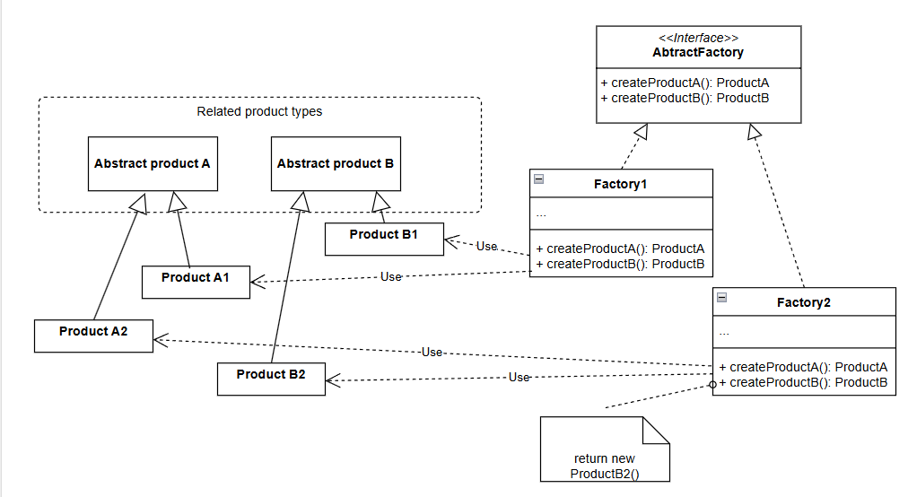

# Abstract factory

## Usage

The abstract factory pattern allows us to create **families** of related objects.

This can be handy if we don't want to mix objects from different families and the list of related objects rarely changes.

Examples: 

* A text editor with multiple look-and-feel mode would want to create its widgets like button, scroll bar, text box , etc in different look-and-feel UIs like MAC, Windows, Motif, etc.

## Structure

