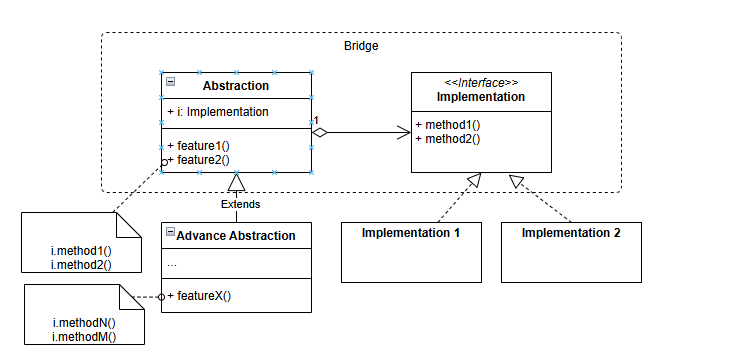

# Bridge

## Usage

Bridge pattern is used to split between the high-level control level (the abstraction), which will not do the real job, and the implementation where all the real job is done.

Example: 

* A GUI system can be run on Mac, Windows or Linux. Each platform would have different API for controlling the UI. In this very case, the GUI may vary for each user type. The GUI is the abstraction and the implementation is the the operating system's API. By using the bridge pattern, we can easily change the GUI without touching the API's classes and easier in adding new operating system support.

## Structure

