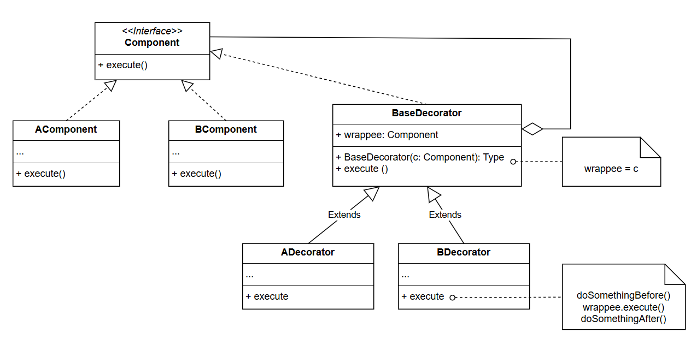

# Decorator pattern

## Usage

Decorator pattern allow us to add responsibility to the existing object by wrapping them in single-component wrapper with compatible interface. 

This can become handy if:

* The concreated wrapped class does not allow extension

* We have multiple responsibility types (wrapper) that can be embedded in the class/object. Extending them using inheritance would result in explosion of classes if we need combined responsibility types.

Example: 

* Text in a text editor can be embellished by putting boxes around them, adding rollbar to them or hiding them in black background, etc. Each of these embellishment can be described as decorator. So if we have a text inside a box that can be scrolled, we don't need a combined class, just you 2 separated decorator.
* The file reading operation can be added the buffering capability or streaming capability, etc.

## Structure

* Component declares the common interface for both wrapper and wrapped objects

* The concreate components like AComponent or BComponent are classes for wrapped objects. 

* The base decorator class has a field for referencing the wrapped object, which can be the concreate component for decorator. The base decorator simply delegates all operations to the wrapped object.

* The concreate decorators like ADecorator or BDecorator would override the BaseDecorator and execute their behavior with parent's behavior.
