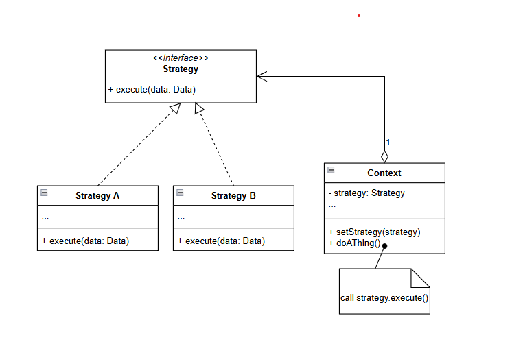

# Strategy pattern

## Usage

The strategy pattern is intended to describe a family of algorithm that have many implementations that need to be changed at runtime.

Example: 

* A routing system that allow to route between 2 point using different vehicles like cars, bikes, public transport or walk.

* A text editor that allow to format a page using different format types.

## Structure

 
