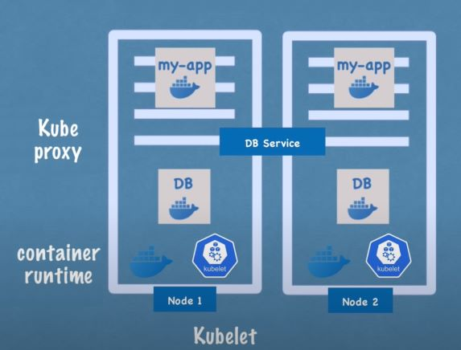
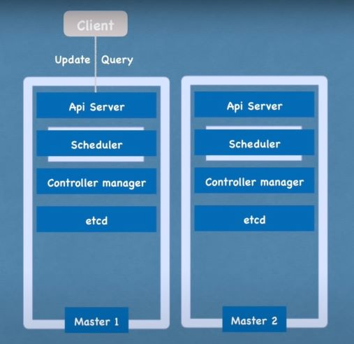

# Architecture

## Worker node

The node actually do the work, each have multiple pods installed on.  
There are services must be installed on:

* **Container runtime** that the pod will run on (Eg: docker)
* **Kuberlet**, which interacts with the container and node to schedule/control the pods
* **Kube proxy**, which handle communication and load balancing

## Master node

The node that control worker nodes and cluster state.  
There are services must be installed on:

* **Api server**  
  Server as a cluster gateway for client requests and performs validation/authentication on requests.

* **Scheduler:**  
  Decide on which worker node, which pod should be scheduled.

* **Control Manager**  
  Detect cluster state changes recover it.  
  Eg: If a pod die, the control manager will detect it and make the scheduler reschedule it

* **etcd**  
  A key-value storage that store all cluster changes help to communicate between components.

A cluster can have multiple master node with api servers is load balanced and etcd(s) are synchronized.

