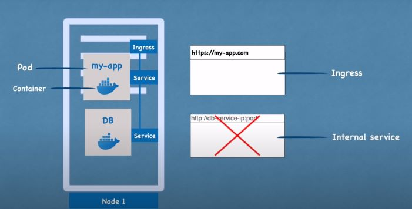
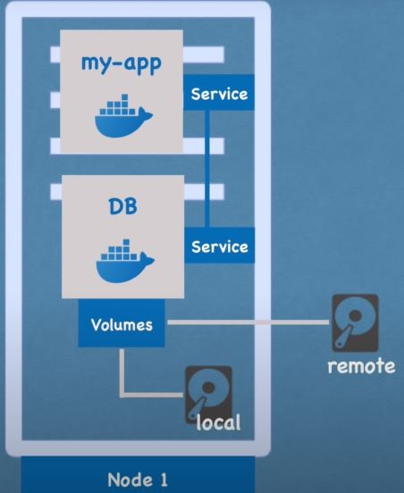
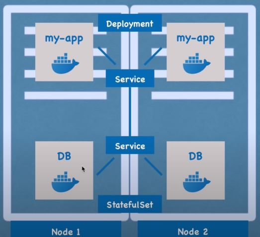

# Components

## Pod

The smallest running unit of K8s.  
It is an abstraction over container.This allows user to switch between different container type.  
Usually, only one application running per pod.

## Service

Each pod will be assigned a IP address, which allow them to communicate with each other. Every time a pod is recreated, a new private IP address is assigned.

Service is a static IP address that can be attacked to each Pod. Since service's life circle and Pod's life circle are not connected, it allows to create a consistent communication chanel.

## Ingress

When expose the application to outside world with a secure protocol and a domain name, the request will go to ingress and it will be forwarded to the service.(You could expose the application by external service but it will have the format of `http:node-address:service-port`)

## Config Map - Secret

Config map contains configurations for application so that you don't have to build the whole image again to apply changes.

Secret likes config map but used to store credential data.

Data in config map or secret can be used as environment variables or properties file

## Volume

Since K8s does not manage data persistence, volumes are used to attack the storage (can be local or external) with the pod.

## Deployment - statefulSet

Deployment and statefulSet are blue-print for creating pods so you could create multiple pods of an application to prevent down time.  
The different is statefulSets are used for stateful application like databases. However, managing stateful application is somewhat tricky so they are usually kept outside of K8s.  
The service will function as a load balancer aside from their communication purpose.

