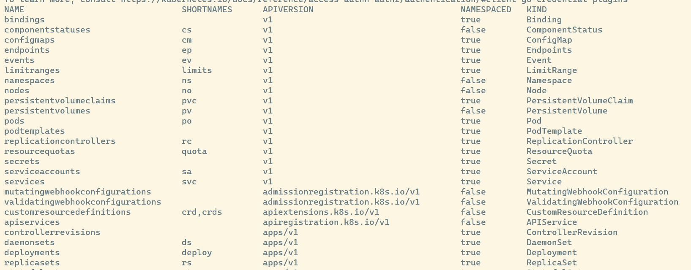

# K8s yaml file

## Structure

A k8s yaml files includes 4 mandatory key-values pairs:

 * kind
 * apiVersion
 * metadata - only resource name is required
 * spec - specify the properties of the resource


## Getting the supported api resources 

A k8s cluster can be extended depends on the provider so it can have different type of resources. To get all api resources that the cluster support:

```sh
kubectl api-resources
```




## Getting the key's documentation

Using the command `explain` for getting the key's documentation that the cluster supports.

```sh
kubectl explain <key>

kubectl explain deployment
kubectl explain deployment.spec
```

Or you could read the documentation page at https://kubernetes.io/docs/reference/kubernetes-api/