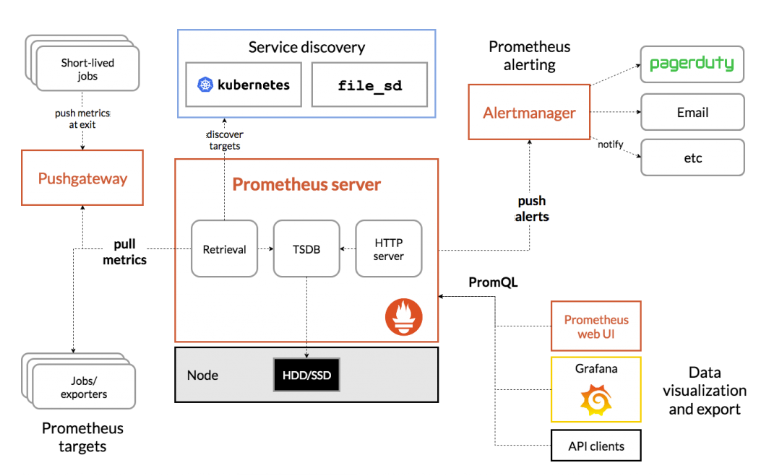

# Prometheus

Prometheus is a tool for monitoring services.

## Components

## How it works

### 1. How data is collected

* An application can provide the metric endpoint with the help of `client libraries` that support multiple languages. Prometheus' data could be configured using metric endpoints to scrape the data.
* Without the help of client libraries, we can use `exporter` which will gather metrics from specific applications (cloud, database, hardware machine, etc)
* The endpoint can also be provided via the service discovery that help to obtains endpoint automatically. E.g. the Kubernetes API returns the endpoint for pods and nodes metrics.
* For those services that running for a short time, which is not suitable for exporting metric via apis, we can push those data to push gateway.

### 2. How data is stored

For storing the data, Prometheus only keep the data for 15 days in default rather than keeping all of them.
We can also config a remote storage via remote_write and remote_read endpoints as a backup.
Prometheus would regularly send data to remote_write and read data from remote_read then combine it with existing data. 