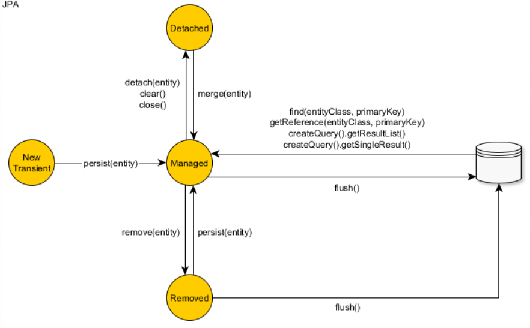

# Entity states

JPA is a transparent persistent mechanisim - entity instances's classes are unaware of their own persistent capability, themself don't know whether the data they are handling is persistent or just temperary.

It's the application's job to call the Java Persistent API for loading or storing data and handling entity instances's persistent state.

1. New (Transition) state  
   An object is newly created and never been associated with a Persistent context is in the New or Transition state.
   To move an object from the transition state to Persistent state, we can call `EntityMagager#persist`
2. Persistent (Managed) state  
   An object is associated with persistent context is in Persistent state.  
   Any changes made toward objects in this state are automatically propagated to context. At the end of the unit of work, all the changes will be commited.
   Beside `EntityManager#persist` or `EntityManager#merge`, an object getting from query, find reference or travelling persistent objected is also persistent.
3. Detached (un-managed) state  
   An entity object becomes detached once the currently running session is closed, and its data state is becomming stale. We can explixitly do that by `EntityManger#detach` to detach one entity or `EntityManager#close` to detach every single entities in the persistent context. Sometimes, this action is needed to prevent the persistent context from out of memory.
   To synchronize the changes of detached or new object, using `EntityManager#merge`.
4. Removed state  
   Associated with the persistent context but are scheduled for removal from the data store after unit of work end.
