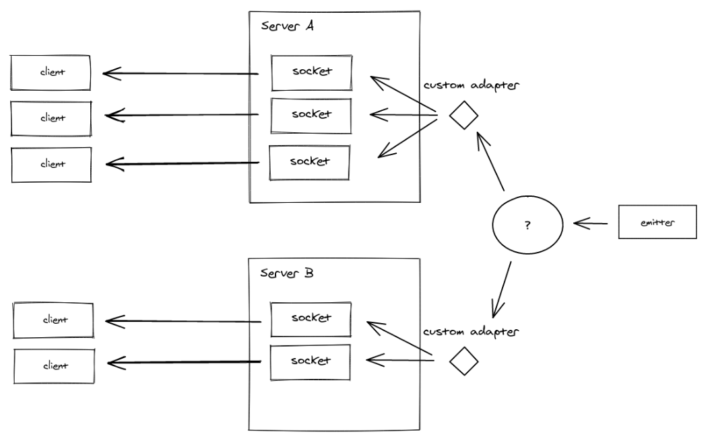

# Adapter

Adapter is a server side component that responsible for broadcasting events to all clients. When you are using multiple servers / nodes in microservice setup , you would need to replace the default in-memory adapter by  other implementation, so events are properly routed.

The adapter can based on various systems, such as:

* Redis

* MongoDb

* Posgress

* Google cloud Pub/sub

* AWS SQS

* Azure Service Bus
