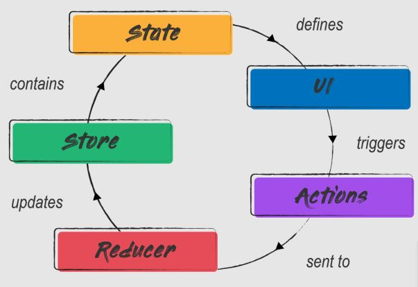

# Redux

## Basic components

* UI: An UI component which trigger changes, eg: an add value button
* Action: The action that we want to take place. It is a plant object whose property `type` and `payload` (optional).
* Reducer: Specify how the state change according to actions. Before a action is handled by a reducer, it can go through middleware(s).
* Store: The state container, it brings every components together, allows states to be retrieved, updated and monitored.
* State: the react component's state
