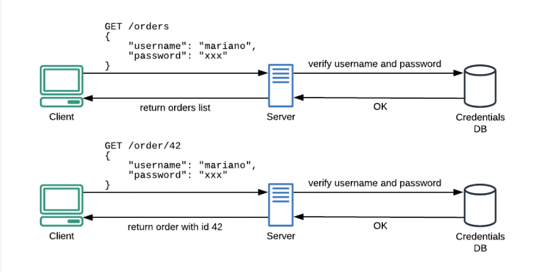
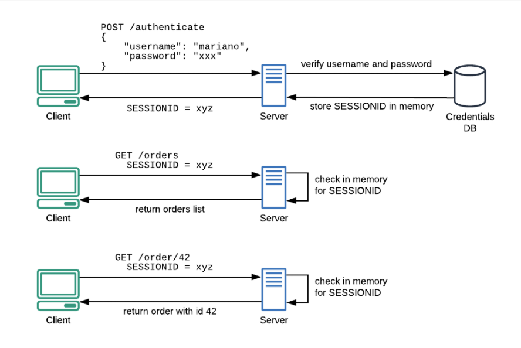
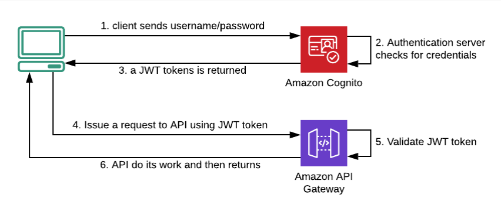

# Authenticate

Authenticate is the process of identifying who is the client, which differ from authorization which is the process of identifying what are the client allowed to do.

There are some popular authenticate models:

## Basic model

Because the Http is stateless, server would required username/password everytime for authentication/authorization.

## Server side session (SSS)

* Server now save authenticate/authorize data in server session, that would prevent unnecessary authentication.

* However, this also cause a problem when the system got scaled(which later required the session synchronization) and also security problem.
  
  ## Json web token (JWT)
  
  

* JWT is a token format. Each token is self-contained, containing sufficient data for checking its validity as well as user information.

* JWT contains 3 parts: `header.payload.signature` (each part is encodes in base 64)
  
  1. header: contain key id and the algorithm which later used in signature
  2. payload: the information + the issurer
  3. signature = encrypt `header.payload` by the given algorithm and a private key.

* To validate JWT, we first get public key from issurer by key id, use that to decrypt the signature and compare with the header and payload  
  => This switches the rolls of public and private keys from the asymmetric algorithm. 