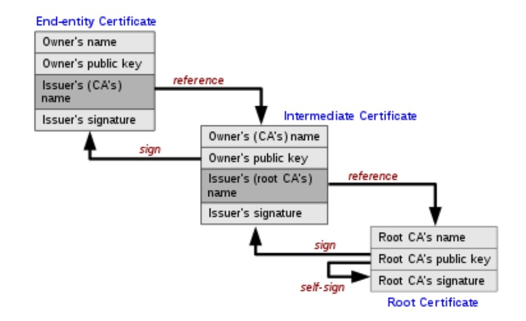

# HTTPS

## Why we need HTTPS

* Secure privacy of message, prevent them from being eavesdropped by attackers

* Ensure integrity of messages, prevent them from being modified

* Guarantee messages from the actual wanting server using the certificate issued by legitimate CA.

## Keys

The keys are used to encrypt and decrypt the messages and should be kept secure. Since symmetric keys are hard to share, in asymmetric keys are preferred in real life.

Asymmetric key pair include private key and public key. Once for encrypt the messages, once for decrypt the messages.

### How key exchange

* Client hello
  The client would also list of available SSL/TLS versions and encryption algorithms (AKA cipher suite) on client side.

* Server hello
  The server would choose the best possible SSL/TLS version and encryption algorithm, then reply with certificate and public key.

* Client key exchange
  The client would check the server's certificate to make sure it is legit. A generated `pre-master-key` will be encrypted using server's public key and send to server.

* Change cipher spec
  The server would decrypt the `pre-master-key` using the server's private. Since the  `pre-master-key` is encrypted using asymmetric key, so nobody could spy on it. The key is used to generate the same `share secret` for client and server that will be used as a symmetric key.]

* Client and server send test messages with the shared message, after that, all messages will be secured.

### Key format

- KEY: The private key format

- CERT: The signed certificate file, allows a site to be marked as trust worthy. The file including public key and additional information such as issuer, valid time, subject, etc. The browser would use these information to validate the site.
* PEM: The based-64 encoding file, could be a private key, public key or certificate. You could decode the `pem` file to check its content.

```shell
openssl x509 -in cert.pem -text
openssl rsa -in key.pem -text
```

* P12 or PFX: File have both certificate and private key pair embedded (AKA `PKCS#12` format), so administrators can easily manage.

## CA - Certificate authority

A certificate authority is a third-party organization which can:

1. Issue certificates

2. Confirm identity of the certificate owner

3. Prove proof that the certificate is valid

Some of the well known CA: Symantec, Comodo, Let's Encrypt, etc. They are trusted to be accepted to the root store which is a database of trusted CAs. Apple, Windows or Mozilla run their own root store and installed it in user's devices.

A certificate authority can sign a certificate using its private key and everyone can verify its content using its public key. Once a certificate is created, it can be used to sign other certificates (They are known as intermediate certificates).

To verify a certificate, the browser or http client would download the issued certificates until the end. If in the process, the certificate is found in the root store, then it is validated, creating a `chain of trust`. Or else, the chain is untrusted.



Each programming model would have their own custom on the HTTPS validation:

### Java

* Truststore (AKA cacerts) is for saving sites that you trust, which will be used to authenticate peers. It is a file in JRE under `lib\security\cacerts` and equivalent to the **root store** that we mentioned above.

* Keystore holds key of your application which can later use to prove integrity of the messages. They can be private keys, certificates with public keys or just secret keys.  They are used if:
  
  * You as a server want clients to talk to you via HTTPS, when a request is sent from a client to a you, you will sent the certificate from your keystore to them. 
  
  * If you as a client and the server and the server request client authentication, you would send the your certificate to them.
