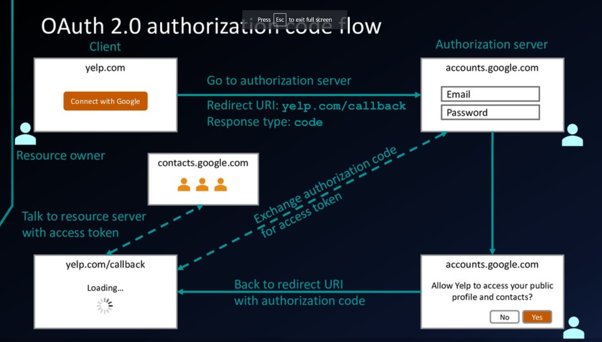

# Authorization flow



## Terms

* Client: the application that asks for authorities
* Resource owner: the user that owns the resource
* Authorization server
* Resource server
* Back channel: the highly secure channel that we could control (Eg: our backend server) 
* Frond channel: the less secure channel that could be interfered(Eg: browser)
* Access token (or bearer token): the token that we could use to get the resource.  
 Each token has a scope indicate which resource could be gained by the token.

## Example of a authorization request:

```http request
https://authorization-server.com/oauth/authorize
?client_id=a17c21ed
&response_type=code
&state=5ca75bd30
&redirect_uri=https%3A%2F%2Fexample-app.com%2Fauth
&scope=photos
```

In that:

* `client_id`: the client id of the application (registered to the authorization server)
* `response_type`: type of the response
* `state`: the state will be returned back after the request successed
* `redirect_uri`: the URI will be redirected after the request successed
* `scope`: the requested scope
