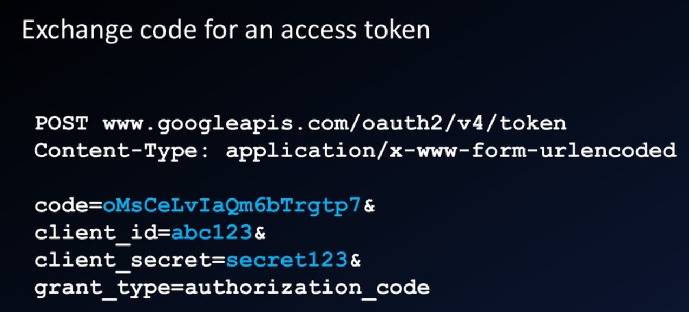

# Authorization type

## Authorization code (frond channel + back channel)

The parameter `response_type`=code in the request.

The authorization request will return a code in the frond channel. The back channel will later use it to exchange the access token. The request would contain the client id and client secret.

## Authorization code with PKCE (Proof key for code exchange)

Using in native apps or SPA - where storing client secret is unsafe.
The parameter `response_type`=code in the request.

The authorization SDK will create a cryptographically-random `code_verifier` and generate `code_challenge` as its signature.  
The auth request will be sent along with `code_challenge`, the auth server will saved this.  
The token exchange request will be sent with `code_verify`, the auth server will verify it with `code_challenge` and return the token.  

This method could be unsecured if redirect_url is not restricted.

## Implicit (frond channel)

The parameter `response_type`=token in the request.

The authorization request will return the token directly

## Client credential (back channel)
