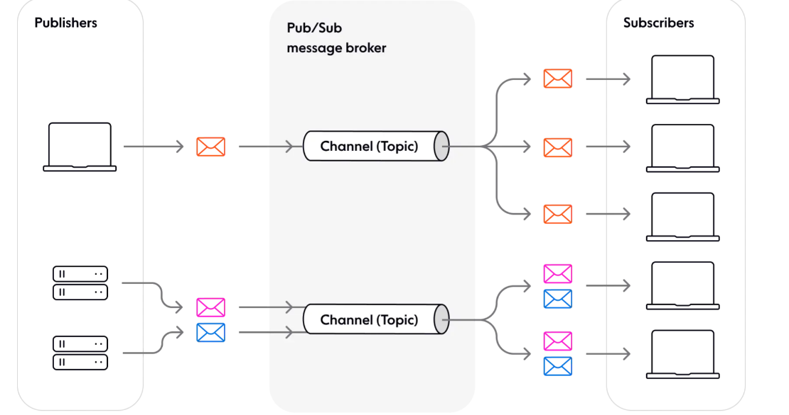

# Pub/sub

## What is it?

The pub/sub architecture is used for exchanging messages between publishers and subscribers. 

Noted that publisher do not send messages to specific subscribers in point-to-point manner but via a message broker, which groups messages into topics (or channels). This is the main different between pub/sub and Observer pattern, which Subject (publisher equivalent) would notify Observers (subscriber equivalent) directly and they must know the know the existence of each others.

## Components

There are 3 key components in pub-sub pattern:

- Publisher: The component that publish the messages

- Subscriber: The component that receive the messages

- The message broker: The component that receive the message from the publisher and send to subscribers. It would groups messages into topics.

## Pros and cons

#### Pros

* Asynchronous activities => mitigate the risk of performance degradation in data-exchange interaction

* Loose coupling between component, making it more modular and flexible

* High scalability, any number of publishers can connect to any number of receivers in theory.

#### Cons

* Testing can be challenging

* The message broker can became a bottleneck for the system if the number of message emissions surge.
